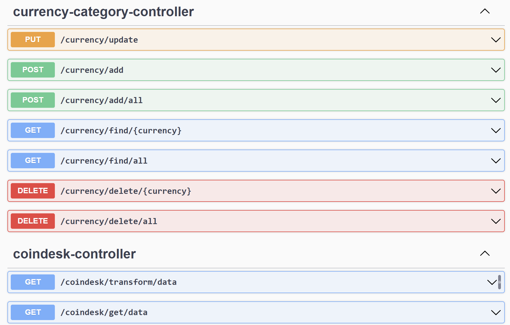

1.AOP應用:
 甲、印出所有API被呼叫 以及 呼叫外部API的 request and response body API
 乙、Error handling 處理API response

2.swagger-ui: http://localhost:8080/swagger-ui/index.html

3.多語系設計: 繁中、簡中、英文、日文。

4.2個以上 design pattern 實作: 工程模式、抽象工程模式、單例模式。

5.能夠運行在Docker: Dockerfile

6.加解密技術應用: AES
